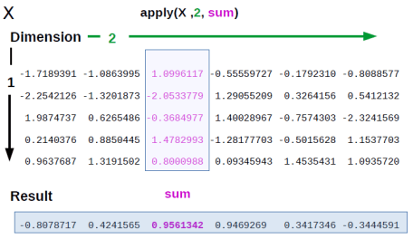
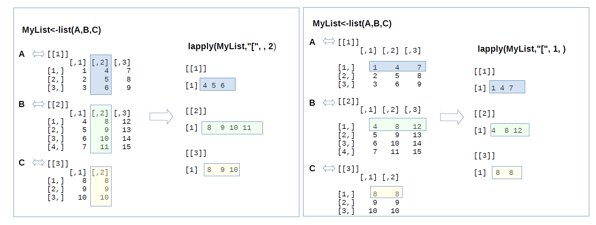
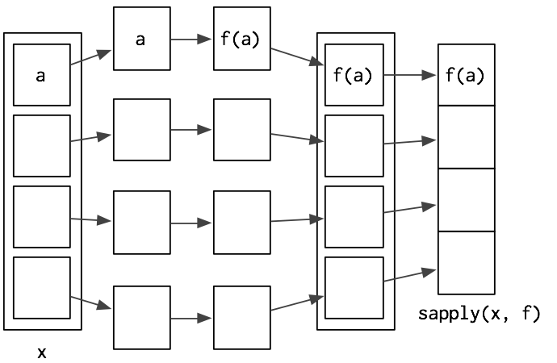

```{r setup, include=FALSE}
knitr::opts_chunk$set(echo = TRUE)
knitr::opts_knit$set(root.dir = '../../')
```

## Vázlat

- [Az ```apply``` függvénycsalád](#az-apply-fuggvenycsalad)
- [Az ```apply``` függvény](#az-apply-fuggveny)
- [A ```lapply``` függvény](#a-lapply-fuggveny)
- [A ```sapply``` függvény](#a-sapply-fuggveny)
- [A ```mapply``` függvény](#a-mapply-fuggveny)
- [Hasonló függvény: az ```aggregate```](#hasonlo-fuggveny-az-aggregate)
- [Összefoglalás](#osszefoglalas)
- [Hatékonyabb package-ek](#hatekonyabb-package-ek)
- [Irodalom](#irodalom)

## Az ```apply``` függvénycsalád
- Az ```apply``` függvénycsalád olyan függvényeket tartalmaz, amiket mátrixok, listák és vektorok repetatív manipulálására, átalakítására, módosítására tudunk használni.
- Úgynevezett higher-order function-ök (= olyan függvények, amiknek függvény a bemenete vagy a kimenete). Az ```apply``` függvénycsaládba tartozó függvények esetében az inputunk lesz függvény (pár más input mellett) és valamilyen módosított objektum lesz a kimenetünk.
- Kiváltják a ciklusok használatát és egy sokkal R-esebb módját nyújtják az iterációknak. Tekinthetünk rájuk úgy is, mint a ciklusok vektorizált megfelelőire, amikkel hatékonyabban, pár sornyi kóddal tudunk iteráltan függvényeket végrehajtani különböző objektumokon.
- Az egyes ```apply``` függvények más-más adatstruktúrájú objektumon (mátrix, lista stb.) dolgoznak, és az általunk megadott függvényt hajtják végre az objektum egy vagy több elemén, során vagy oszlopán (adatstruktúrától függően). Kimenetként egy a függvény szerint módosított objektumot kapunk, aminek az adatstruktúrája megegyezhet vagy el istérhet az eredeti objektummal.
- A bemeneti és kimeneti objektum adatstruktúrájának függvényében választjuk meg, hogy melyik ```apply``` függvényt használjuk. Pl. ha tudjuk, hogy egy mátrixunk van, és egy vektort szeretnénk kapni az adatmanipulálás után, akkor az ```apply``` függvényt fogjuk használni, ha listánk van és listát szeretnénk kapni az adatmanipulálás után, akkor a ```lapply``` függvényt.
- Az ```apply``` függvényeken belül meghívott függvény lehet egy package-ben definiált és a felhasználó által definiált függvény is. Pl.:
    - aggregáló függvény, mint a ```mean``` vagy a ```sum```, ami egy értékkel fog visszatérni vagy egy user által definiált standardizáló függvény,
    - más átalakító függvény, mint pl. az ```strsplit``` vagy
    - bármilyen más vektorizált függvény.
- A függvénycsalád tagjai az ```apply```, a ```lapply```, a ```sapply```, a ```mapply```, a ```vapply```, a ```rapply``` és a ```tapply``` függvények.

## Az ```apply``` függvény

- Az ```apply``` array objektumokon működik, mi mátrixokon (2D array) fogjuk megnézni a működését, illetve data frame-eken, de azokat is mátrixszá alakítja automatikusan.
- A függvényt a következőképp hívjuk meg: ```apply(X, MARGIN, FUN, ...)```, ahol:
    - ```X``` a mátrix.
    - a ```MARGIN``` határozza meg, hogy a mátrix sorain (```MARGIN = 1```) vagy oszlopain (```MARGIN = 2```) hajtsa végre a műveletet.
    - a ```FUN``` argumentumnál a függvényt adjuk meg, amit alkalmazni szeretnénk a sorokon vagy az oszlopokon.

<br>
```{r, echo=FALSE, out.width = "500px", fig.align = "center"}

```
<br><br>

```{r, echo = TRUE, error = TRUE}
#----apply függvény-------------------------------------------------------------
# 5x6-os mátrix st. normális elo-ból vett értékekkel
X <- matrix(rnorm(30), nrow = 5, ncol = 6)
X

# értékek összegének lekérése minden oszlopra
# eddig for ciklussal így csináltuk volna
# vektort szeretnénk kapni, ezért definiálunk egyet
X_colsum <- NA
for (j in 1:ncol(X)) {
  X_colsum[j] <- sum(X[, j])
}
X_colsum

# értékek összegének lekérése minden oszlopra
apply(X, 2, sum)

# értékek összegének lekérése minden sorra
apply(X, 1, sum)

# értékek átlagának lekérése minden sorra
apply(X, 1, mean)

# data frame definiálása
df <- data.frame(sex = c("F", "F", "M", "M", "F", "M"), 
                 age = c(12, 34, 52, 34, 45, 56),
                 height = c(150, 165, 187, 190, 172, 178),
                 class = c("A", "B", "A", "B", "B", "B"))
df

# age és height oszlopok átlaga
# vektorrá alakítja
apply(df[, 2:3], 2, mean)

# sex és class oszlopokhoz karakter hozzáfűzése
# mátrixszá alakítja
apply(df[, c(1, 4)], 2, function(x) paste0(x, "_paste"))

# as.data.frame függvénnyel data frame-et kapunk vissza
as.data.frame(apply(df[, c(1, 4)], 2, function(x) paste0(x, "_paste")))
```

## A ```lapply``` függvény
- A ```lapply``` függvényt is hasonlóan hívjuk meg: ```lapply(X, FUN, ...)```, de itt nem értelmezhető az oszlop vagy a sor, mivel listákon dolgozik.
- Lista az input, aminek az elemei lehetnek szintén listák, data frame-ek, vektorok, stb.
- Olyan hosszúságú listával tér vissza, ahány eleme volt az input objektumnak.

<br>
```{r, echo=FALSE}

```
<br><br>

```{r, echo = TRUE, error = TRUE}
#----lapply függvény------------------------------------------------------------
# 3 mátrix definiálása, majd összefűzése egy listába
A <- matrix(1:9, 3, 3)
B <- matrix(4:15, 4, 3)
C <- matrix(8:10, 3, 2)
MyList <- list(A, B, C)

# minden második oszlop kiszedése a mátrixok listájából
# ezt for-ral eddig így csináltuk volna
MyList_secondcols <- list()
for (i in 1:length(MyList)) {
  MyList_secondcols[[i]] <- MyList[[i]][, 2] 
}
MyList_secondcols

# minden második oszlop kiszedése a mátrixok listájából
lapply(MyList, "[", , 2)
# vagy
lapply(MyList, function(x) x[, 2])

# minden első sor kiszedése a mátrixok listájából
lapply(MyList, "[", 1, )
# vagy
lapply(MyList, function(x) x[1, ])

# minden első sor 3. elem kiszedése a mátrixok listájából
lapply(MyList, "[", 1, 2)
# vagy
lapply(MyList, function(x) x[1, 2])

# mátrixok minden elemének összege
lapply(MyList, sum)

# mátrixok első sorainak összege
lapply(MyList, function(x) sum(x[1, ]))
```
- A ```lapply``` első argumentuma az input objektum.
- A ```[``` jel a a kiválasztó operátor, ezután megszabjuk, hogy a sorokból és az oszlopokból melyik eleme(ke)t szeretnénk megkapni. Ahol üresen marad, az azt jelenti, hogy minden elemet meg szeretnénk kapni adott indexre.
- Vagy definiálunk egy függvényt, amiben a megszokott módon indexeljük az objektumot, előző példában a mátrixokat.

## A ```sapply``` függvény
- A ```sapply``` függvény is hasonlóan néz ki: ```sapply(X, FUN, ..., simplify = TRUE)```
- Úgy működik, mint a ```lapply```, de ha teheti, a lehető legegyszerűbb adatstruktúrával tér vissza, vektorral vagy mátrixszal. Ezt jelzi a ```simplify = TRUE``` argumentum. Ha ez ```FALSE```, ugyanúgy működik, mint a ```lapply```.

<br>
```{r, echo=FALSE, out.width = "300px", fig.align = "center"}
knitr::include_graphics("../../pic/lapply2.png")
```
<br><br><br>
```{r, echo=FALSE, out.width = "400px", fig.align = "center"}

```
<br><br>

```{r, echo = TRUE, error = TRUE}
#----sapply függvény------------------------------------------------------------
# minden második oszlop kiszedése a mátrixok listájából
# nincs egyszerűbb adatstruktúra a listánál, ezért listával tér vissza
sapply(MyList, function(x) x[, 2])

# minden első sor 3. elem kiszedése a mátrixok listájából
# leegyszerűsíti az adatstruktúrát vektorra
sapply(MyList, "[", 1, 2)
# vagy
sapply(MyList, function(x) x[1, 2])

# mátrixok minden elemének összege
sapply(MyList, sum)

# mátrixok első sorainak összege
sapply(MyList, function(x) sum(x[1, ]))
```

## A ```mapply``` függvény
- A ```mapply``` függvényt is hasonlóan hívjuk meg: ```mapply(FUN, ..., simplify = TRUE)```, de itt nem értelmezhető az ```X``` argumentum, mert kimondottan egy függvényt szeretnénk repetatívan végrehajtani.
- A ```mapply```-ra a ```sapply``` többváltozós verziójaként tekinthetünk.
- Az a célja, hogy olyan függvényekben is vektorizáltan tudjuk kezelni az argumentumokat, amik eredetileg nem fogadnak el vektorokat.

```{r, echo = TRUE, error = TRUE}
#----mapply függvény------------------------------------------------------------
# 4x4-es mátrix, amit a rep függvény többszörös használátával hozunk létre
# a rep függvénnyel létrejövő vektorokat a c függvénnyel kapcsoljuk össze
m <- matrix(c(rep(1, 4), rep(2, 4), rep(3, 4), rep(4, 4)), 4, 4)
m

# mapply segítségével
m <- mapply(rep, 1:4, 4)
m
```

## Hasonló függvény: az ```aggregate```
- A használata: ```aggregate(x, by, FUN, ..., simplify = TRUE)```
- Data frame-ek manipulálására jól alkalmazható.
- Abban hasonlít az ```apply``` függvénycsaládba tartozó függvényekhez, hogy az első argumentuma az az objektum, amin a függvényt végre szeretnénk hajtani és ezt a függvényt a ```FUN``` argumentummal tudjuk definiálni. Ezenkívül a ```sapply```-hoz hasonlóan a lehető legegyszerűbb adatstruktúrával tér vissza, amit a ```simplify``` argumentummal tudunk állítani.
- A különbség, hogy van egy ```by``` argumentuma, amivel meg tudjuk szabni, hogy milyen változókon vagy egy data frame mely részein szeretnénk alkalmazni a függvényt. A ```by```-ban megadott változó(k)nak list adatstruktúrájúnak kell lennie.
- Másik használata: ```aggregate(formula, data, FUN, ...)```
- Az aggregálást a ```formula``` argumentummal is meg lehet adni ```y ~ x``` formában, ahol az ```y ```numerikus adat, amit aggregálni szeretnénk valamilyen függvénnyel ```x``` mentén.
- Data frame-mel tér vissza.

```{r, echo = TRUE, error = TRUE}
#----aggregate függvény---------------------------------------------------------
# apply függvénynél használt data frame
df

# életkor nemenként - by argumentummal
aggregate(df$age, by = list(sex = df$sex), mean)

# életkor, magasság nemenként - by argumentummal
aggregate(df[, 2:3], by = list(sex = df$sex), mean)

# életkor nem és osztály szerinti bontásban - by argumentummal
aggregate(df$age, by = list(sex = df$sex, class = df$class), mean)

# életkor nemenként - formula argumentummal
aggregate(age ~ sex, data = df, mean)

# életkor, magasság nemenként - formula argumentummal
aggregate(cbind(age, height) ~ sex, data = df, mean)

# életkor nem és osztály szerinti bontásban - formula argumentummal
aggregate(age ~ sex + class, data = df, mean)
```

## Összefoglalás
|                    | Array    | Data frame  | List   | Vector |
|--------------------|----------|-------------|--------|--------|
| Array              | apply    |             |        | apply  |
| Data frame         | apply    | aggregate   | by     | apply  |
| List               | sapply   |             | lapply | sapply |
| Function arguments | mapply   |             | mapply | mapply |

## Hatékonyabb package-ek
- Az ```apply``` függvénycsaládba tartozó függvények a ```base``` package tagjai. Ha ezeknek a kezelésében már gyakorlottak vagytok, a hatékonyabb munka érdekében ezeknek a package-eknek a használatát érdemes elsajáítani:
    - [```dplyr```](https://www.slideshare.net/shakthydoss/5-r-tutorial-dplyr-apply-function){target="_blank"} - könnyen érthető nyelvezet
    - [```data.table```](https://github.com/Rdatatable/data.table/wiki/Getting-started){target="_blank"} - jobban skálázódik, gyors sok adatnál is
    - [```dplyr``` és ```data.table``` összehasonlítás](http://www.brodieg.com/?p=7){target="_blank"}

## Irodalom
- Lander 11
- [DataCamp tutorial](https://www.datacamp.com/community/tutorials/r-tutorial-apply-family#family){target="_blank"}
- [Advanced R](http://adv-r.had.co.nz/Functionals.html){target="_blank"}