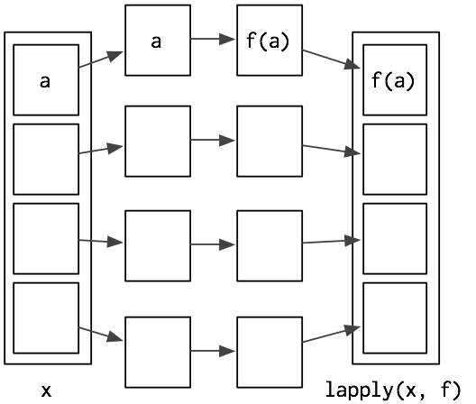

```{r setup, include=FALSE}
knitr::opts_chunk$set(echo = TRUE)
knitr::opts_knit$set(root.dir = '../../')
```

## Vázlat

- [Az ```apply``` függvénycsalád](#az-apply-fuggvenycsalad)
- [Az ```apply``` függvény](#az-apply-fuggveny)
- [A ```lapply``` függvény](#a-lapply-fuggveny)
- [A ```sapply``` függvény](#a-sapply-fuggveny)
- [A ```mapply``` függvény](#a-mapply-fuggveny)
- [Hasonló függvény: az ```aggregate```](#hasonlo-fuggveny-az-aggregate)
- [Összefoglalás](#osszefoglalas)
- [Hatékonyabb package-ek](#hatekonyabb-package-ek)
- [Irodalom](#irodalom)

## Az ```apply``` függvénycsalád
- Az ```apply``` függvénycsalád olyan függvényeket tartalmaz, amik kiválóan alkalmasak mátrixok, listák, vektorok és data frame-ek repetatív manipulálására, átalakítására.
- Kiváltják a ciklusok használatát és egy sokkal R-esebb módját nyújtják az iterációknak. Tulajdonképpen a ciklusok vektorizált megfelelői, amikkel hatékonyabban, pár sornyi kóddal tudunk műveleteket végrehajtani.
- Az egyes függvények más-más adatstruktúrájú inputon (mátrix, lista stb.) dolgoznak, és egy általunk megadott függvényt hajtanak végre az input egy vagy több elemén, során vagy oszlopán.
- Az output adatstruktúrája is eltérő lehet attól függően, hogy melyik függvényt használjuk.
- Az ```apply``` függvényeken belül meghívott függvény lehet egy package-ben definiált és a felhasználó által definiált függvény is. Pl.:
    - aggregáló függvény, mint a ```mean``` vagy a ```sum```, ami egy értékkel fog visszatérni
    - más átalakító függvény, mint az ```strsplit``` vagy
    - bármilyen más vektorizált függvény.
- A függvénycsalád tagjai az ```apply```, a ```lapply```, a ```sapply```, a ```mapply```, a ```vapply```, a ```rapply``` és a ```tapply``` függvények.

## Az ```apply``` függvény

- Az ```apply``` array objektumokon működik, mi mátrixokat fogunk nézni (2D array).
- A függvényt a következőképp hívjuk meg: ```apply(X, MARGIN, FUN, ...)```, ahol:
    - ```X``` a mátrix. (Lehet data frame is, de mátrixszá fogja alakítani, úgyhogy nincs sok értelme.)
    - a ```MARGIN``` határozza meg, hogy a mátrix sorain (```MARGIN = 1```) vagy oszlopain (```MARGIN = 2```) hajtsa végre a műveletet. ```MARGIN = c(1, 2)``` esetén mindkét irányban végrehajtja.
    - a ```FUN``` argumentumnál a függvényt adjuk meg, amit alkalmazni szeretnénk a sorokon vagy az oszlopokon.


```{r, echo = TRUE, error = TRUE}
#----apply függvény-------------------------------------------------------------
# 5x6-os mátrix st. normális elo-ból vett értékekkel
m <- matrix(rnorm(30), nrow = 5, ncol = 6)
m

# értékek összegének lekérése minden oszlopra
apply(m, 2, sum)

# értékek összegének lekérése minden sorra
apply(m, 1, sum)

# értékek átlagának lekérése minden sorra
apply(m, 1, mean)
```

## A ```lapply``` függvény
- A ```lapply``` függvényt is hasonlóan hívjuk meg: ```lapply(X, FUN, ...)```, de itt nem értelmezhető az oszlop vagy a sor, mivel listákon dolgozik.
- Lista az input, aminek az elemei lehetnek szintén listák, data frame-ek, vektorok, stb.
- Olyan hosszúságú listával tér vissza, ahány eleme volt az input objektumnak.


```{r, echo = TRUE, error = TRUE}
#----lapply függvény------------------------------------------------------------
# 3 mátrix definiálása, majd összefűzése egy listába
A <- matrix(1:9, 3, 3)
B <- matrix(4:15, 4, 3)
C <- matrix(8:10, 3, 2)
MyList <- list(A, B, C)

# minden második oszlop kiszedése a mátrixok listájából
lapply(MyList, "[", , 2)
# vagy
lapply(MyList, function(x) x[, 2])

# minden első sor kiszedése a mátrixok listájából
lapply(MyList, "[", 1, )
# vagy
lapply(MyList, function(x) x[1, ])

# minden első sor 3. elem kiszedése a mátrixok listájából
lapply(MyList, "[", 1, 2)
# vagy
lapply(MyList, function(x) x[1, 2])

# mátrixok minden elemének összege
lapply(MyList, sum)

# mátrixok első sorainak összege
lapply(MyList, function(x) sum(x[1, ]))
```
- A ```lapply``` első argumentuma az input objektum.
- A ```[``` jel a a kiválasztó operátor, ezután megszabjuk, hogy a sorokból és az oszlopokból melyik eleme(ke)t szeretnénk megkapni. Ahol üresen marad, az azt jelenti, hogy minden elemet meg szeretnénk kapni adott indexre.
- Vagy magunk definiálunk egy függvényt, amiben a megszokott módon indexelünk.

## A ```sapply``` függvény
- A ```sapply``` függvény is hasonlóan néz ki: ```sapply(X, FUN, ..., simplify = TRUE)```
- Úgy működik, mint a ```lapply```, de ha teheti, a lehető legegyszerűbb adatstruktúrával tér vissza, vektorral vagy mátrixszal. Ezt jelzi a ```simplify = TRUE``` argumentum. Ha ez ```FALSE```, ugyanúgy működik, mint a ```lapply```.

```{r, echo=FALSE, out.width = "300px"}

```
-------------------
```{r, echo=FALSE, out.width = "400px"}

```

```{r, echo = TRUE, error = TRUE}
#----sapply függvény------------------------------------------------------------
# minden második oszlop kiszedése a mátrixok listájából
sapply(MyList, function(x) x[, 2])

# minden első sor 3. elem kiszedése a mátrixok listájából
sapply(MyList, "[", 1, 2)
# vagy
sapply(MyList, function(x) x[1, 2])

# mátrixok minden elemének összege
sapply(MyList, sum)

# mátrixok első sorainak összege
sapply(MyList, function(x) sum(x[1, ]))
```

## A ```mapply``` függvény
- A ```mapply``` függvényt is hasonlóan hívjuk meg: ```mapply(FUN, ..., simplify = TRUE)```, de itt nem értelmezhető az ```X``` argumentum, mert kimondottan egy függvényt szeretnénk repetatívan végrehajtani.
- A ```mapply```-ra a ```sapply``` többváltozós verziójaként tekinthetünk.
- Az a célja, hogy olyan függvényekben is vektorizáltan tudjuk kezelni az argumentumokat, amik eredetileg nem fogadnak el vektorokat.

```{r, echo = TRUE, error = TRUE}
#----mapply függvény------------------------------------------------------------
# 4x4-es mátrix, amit a rep függvény többszörös használátával hozunk létre
# a rep függvénnyel létrejövő vektorokat a c függvénnyel kapcsoljuk össze
m2 <- matrix(c(rep(1, 4), rep(2, 4), rep(3, 4), rep(4, 4)), 4, 4)
m2

# mapply segítségével
m2 <- mapply(rep, 1:4, 4)
m2
```

## Hasonló függvény: az ```aggregate```
- A használata: ```aggregate(x, by, FUN, ..., simplify = TRUE)```
- Data frame-ek manipulálására jól alkalmazható.
- Abban hasonlít az ```apply``` függvénycsaládba tartozó függvényekhez, hogy az első argumentuma az az objektum, amin a függvényt végre szeretnénk hajtani. Ezt a függvény a ```FUN``` argumentummal tudjuk definiálni. A ```sapply```-hoz hasonlóan a lehető legegyszerűbb adatstruktúrával tér vissza, amit a ```simplify``` argumentummal tudunk állítani.
- A különbség, hogy van egy ```by``` argumentuma, amivel meg tudjuk szabni, hogy milyen változókon vagy egy data frame mely részein szeretnénk alkalmazni a függvényt.
- Data frame-mel tér vissza.

## Összefoglalás
|                    | Array    | Dataframe     | List   | Vector |
|--------------------|----------|---------------|--------|--------|
| Array              | apply    |               |        |        |
| Data frame         |          | aggregate     | by     |        |
| List               |   sapply |               | lapply |  sapply|
| Function arguments | mapply   |               | mapply |        |

## Hatékonyabb package-ek
- Az ```apply``` függvénycsaládba tartozó függvények a ```base``` package tagjai.
- [```dplyr```](https://www.slideshare.net/shakthydoss/5-r-tutorial-dplyr-apply-function){target="_blank"} - könnyen érthető nyelvezet
- [```data.table```](https://github.com/Rdatatable/data.table/wiki/Getting-started){target="_blank"} - jobban skálázódik, gyors sok adatnál is
- [összehasonlítás](http://www.brodieg.com/?p=7){target="_blank"}

## Irodalom
- Lander 11
- [DataCamp tutorial](https://www.datacamp.com/community/tutorials/r-tutorial-apply-family#family){target="_blank"}
- [Advanced R](http://adv-r.had.co.nz/Functionals.html){target="_blank"}